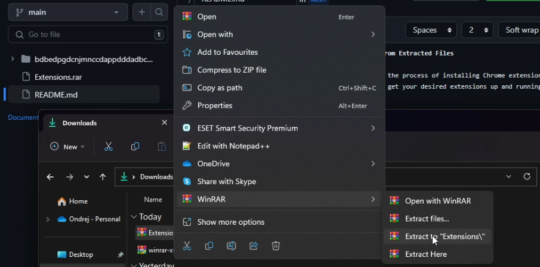
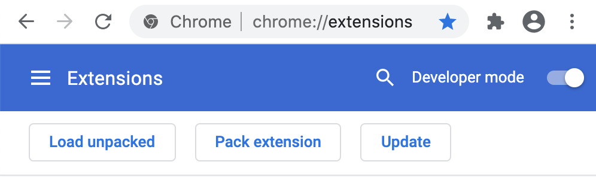
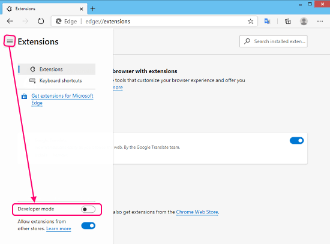
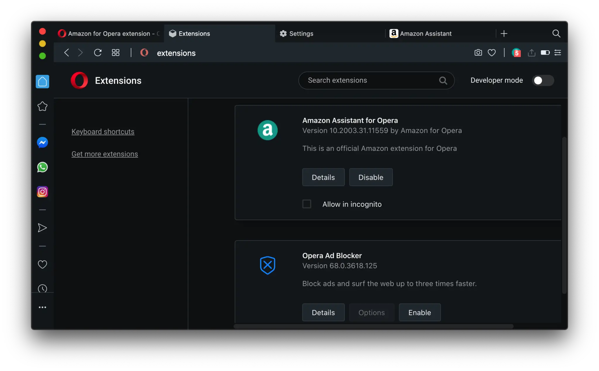
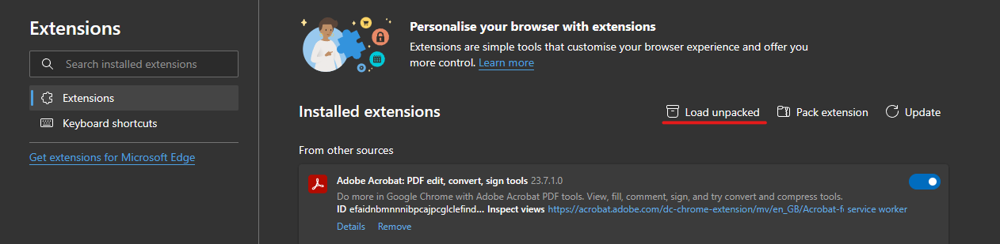
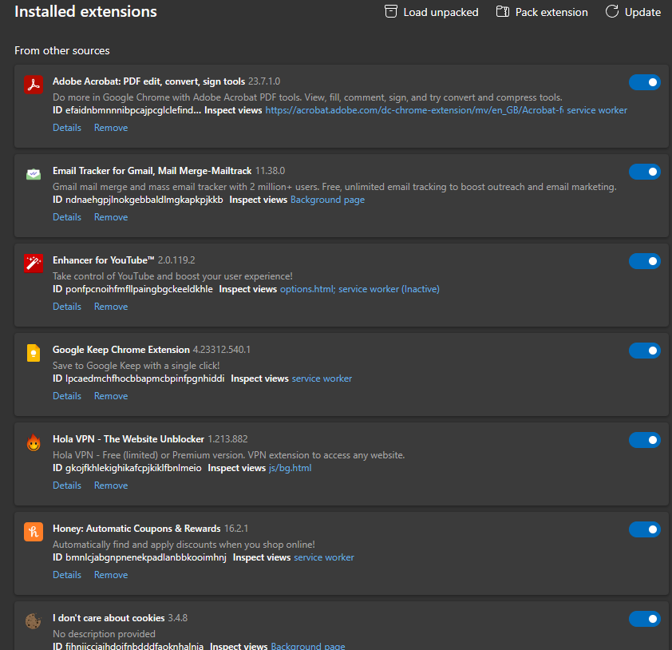

## Tutorial: Installing Chrome Extensions from Extracted Files

In this tutorial, we will guide you through the process of installing Chrome extensions from extracted files. Follow these steps to get your desired extensions up and running!

### Step 1: Extract the Downloaded RAR File

Start by extracting the downloaded RAR file to a location on your computer. This RAR file contains the extension files you need for installation. Here's how:

1. Download the RAR file to your computer.
2. Right-click the RAR file and select "Extract" or "Extract Here".
3. Choose a destination folder for the extracted files.

### Step 2: Enable Developer Mode in Your Browser

Before you can install extensions from extracted files, you need to enable Developer Mode in your browser. Here are the steps for popular browsers like Chrome, Edge, and Opera:

#### Google Chrome:

1. Open Google Chrome.
2. Click the three dots menu in the upper-right corner.
3. Go to "More tools" > "Extensions".
4. Toggle on the "Developer mode" switch.

#### Microsoft Edge:

1. Open Microsoft Edge.
2. Click the three dots menu in the upper-right corner.
3. Select "Extensions".
4. Turn on the "Developer mode" toggle.

#### Opera:

1. Launch Opera.
2. Click the "Opera" menu in the top-left corner.
3. Choose "Extensions" > "Extensions".
4. Enable the "Developer mode" option.

### Step 3: Load Unpacked Extension

Now that Developer Mode is enabled, you can proceed to load the unpacked extension files:

1. Open the "Extensions" page in your browser as described in Step 2.
2. Click the "Load unpacked" or "Load extension" button.
3. Navigate to the folder where you extracted the extension files in Step 1 and select the folder.
4. The extension will be added to your browser.

### Step 4: Repeat for Each Extension

If you have multiple extensions to install, repeat Step 3 for each extracted extension folder. This way, you can install all the desired extensions one by one.

### Step 5: Enjoy Your Extensions

Congratulations! You have successfully installed your desired extensions from the extracted files. You should now see the extension icons in your browser's toolbar or extensions menu.

Feel free to customize your browsing experience with these new tools and features!

## Extension Pack: Adobe Acrobat, Gmail Tools, and More

### Adobe Acrobat: PDF Edit, Convert, Sign Tools
Version: 23.7.1.0
Do more in Google Chrome with Adobe Acrobat PDF tools. View, fill, comment, sign, and try convert and compress tools.

### Email Tracker for Gmail, Mail Merge-Mailtrack
Version: 11.38.0
Gmail mail merge and mass email tracker with 2 million+ users. Free, unlimited email tracking to boost outreach and email marketing.

### Enhancer for YouTube™
Version: 2.0.119.2
Take control of YouTube and boost your user experience!

### Google Keep Chrome Extension
Version: 4.23312.540.1
Save to Google Keep with a single click!

### Hola VPN - The Website Unblocker
Version: 1.213.882
Hola VPN - Free (limited) or Premium version. VPN extension to access any website.

### Honey: Automatic Coupons & Rewards
Version: 16.2.1
Automatically find and apply discounts when you shop online!

### I don't care about cookies
Version: 3.4.8
No description provided

### PrintFriendly - Print and PDF Web Pages
Version: 3.4.3
Make web pages printer-friendly and convert them to PDFs. Easily remove ads and navigation, and customize what you print or PDF.

### Raindrop.io
Version: 5.6.14
All-in-one bookmark manager

### Return YouTube Dislike
Version: 3.0.0.10
Returns ability to see dislikes

### Sound Booster 2023 - Volume Control
Version: 2.4
Boost sound, enhance bass, control volume, versatile equaliser & convenient volume control. Experience louder music or video volume.

### SponsorBlock for YouTube - Skip Sponsorships
Version: 5.4.15
Skip sponsorships, subscription begging and more on YouTube videos. Report sponsors on videos you watch to save others' time.

### Tripadvisor Browser Button
Version: 1.1.2.4
Tripadvisor's official browser extension. Know Better, Book Better, Go Better

### Volume Master
Version: 1.13.2
Up to 600% volume boost

### WhatRuns
Version: 1.7.11
Discover what runs a website. Frameworks, Analytics Tools, WordPress Plugins, Fonts - you name it.

### uBlock Origin
Version: 1.51.0
Finally, an efficient blocker. Easy on CPU and memory.

